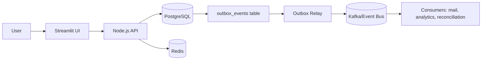
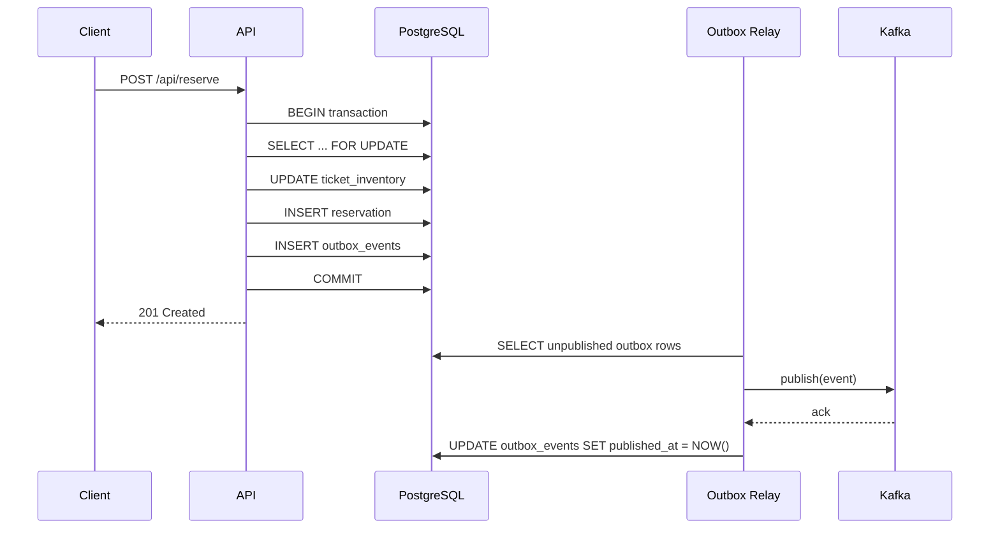

# Flash-Sale Ticketing System

This repository is a demo implementation of a flash-sale ticketing platform designed to show safe inventory handling under high concurrency. It includes an API, a background worker, a Streamlit UI, and local infrastructure composed with Docker.

## What Is Implemented

- `db/init.sql`: PostgreSQL schema and mock seed data.
- `docker-compose.yml`: local services for Postgres, Redis, API, and worker.
- `api/`: minimal Node.js API (`/health`, `/api/events`).
- `worker/`: expiration worker that restores inventory and writes outbox events.
- `ui/app.py`: Streamlit UI to read event inventory from the API.

## High-Level Architecture



System responsibilities:

- API handles request validation and transactional writes.
- PostgreSQL is the source of truth for inventory, reservations, orders, and outbox.
- Redis helps with short-lived coordination (locks/rate-limit/TTL patterns).
- Worker/relay handles asynchronous background work outside the API request path.

## Why `event_inventory_view` Exists

`event_inventory_view` is a SQL view that joins `events` and `ticket_inventory` so the UI/API can read a simple, ready-to-display projection.

It avoids repeating the same join query in multiple places and keeps read endpoints straightforward.

## Outbox Pattern (Detailed)

### The problem

If the API does:
1. update DB state, and then
2. publish to Kafka,

there is a failure gap between those operations.

- DB success + publish fail => missing event
- publish success + DB rollback => ghost event

Both are consistency bugs.

### The solution

Write the event to `outbox_events` **inside the same DB transaction** as the business state change. Then a separate relay process publishes outbox rows to Kafka and marks them published.

This gives atomic DB persistence and reliable async publish.

### Outbox sequence



### Transaction example

```sql
BEGIN;

SELECT remaining_capacity
FROM ticket_inventory
WHERE event_id = $1 AND ticket_type = $2
FOR UPDATE;

UPDATE ticket_inventory
SET remaining_capacity = remaining_capacity - $3,
		version = version + 1,
		updated_at = NOW()
WHERE event_id = $1 AND ticket_type = $2;

INSERT INTO reservations (id, user_id, event_id, ticket_type, quantity, status, expires_at)
VALUES (gen_random_uuid(), $4, $1, $2, $3, 'PENDING', NOW() + INTERVAL '5 minutes');

INSERT INTO outbox_events (id, aggregate_type, aggregate_id, event_type, payload)
VALUES (
	gen_random_uuid(),
	'reservation',
	<reservation_id>,
	'reservation.created',
	jsonb_build_object('reservationId', <reservation_id>, 'userId', $4, 'quantity', $3)
);

COMMIT;
```

### Relay behavior

- Poll rows where `published_at IS NULL`.
- Publish each row payload to Kafka.
- Only after broker ack, update `published_at`.
- Retry on transient failure with backoff.
- Keep consumers idempotent because delivery is usually at-least-once.

## Local Setup

This project is configured for the simplest local developer workflow:

- PostgreSQL and Redis run in Docker
- The API and worker run locally on your laptop
- No rebuild is required for normal code edits in `api/` or `worker/`

### 1. Start only the infrastructure containers

```powershell
docker compose up -d postgres redis
```

### 2. Install dependencies and start the API locally

```powershell
cd api
npm install
npm run dev
```

### 3. Install dependencies and start the worker locally

```powershell
cd worker
npm install
node index.js
```

### 4. Verify the database is ready

```powershell
docker compose exec postgres psql -U postgres -d ticketing -c "SELECT * FROM event_inventory_view;"
```

### 5. Check the app endpoints

- `http://localhost:3000/health`
- `http://localhost:3000/api/events`

### 6. Run the UI locally

```powershell
cd ui
python -m venv venv
venv\Scripts\activate
pip install -r requirements.txt
streamlit run app.py
```

Then open:

- `http://localhost:8501`

## When you need a rebuild

Run `docker compose up -d --build` only when you change:

- `Dockerfile` files
- dependency files such as `package.json` or `requirements.txt`
- container setup in `docker-compose.yml`

Regular source-code edits in `api/`, `worker/`, or `ui/` do not require rebuilding Docker.

## Notes

- Keep real secrets in local `.env` only.
- Commit `.env.example`, not `.env`.
- PostgreSQL remains the source of truth even if Redis/Kafka are unavailable.

